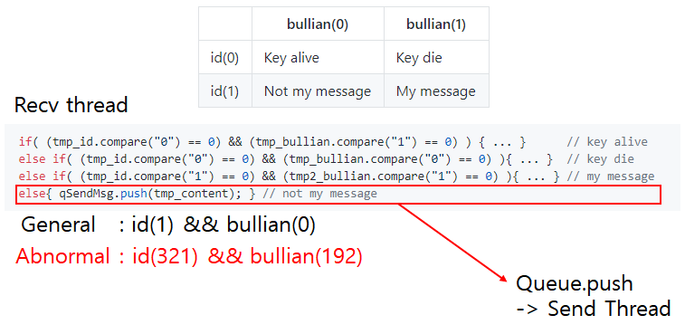
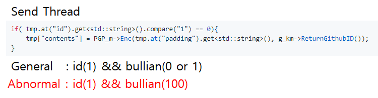
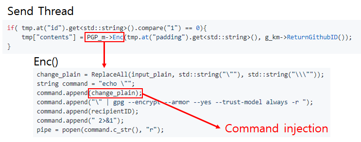
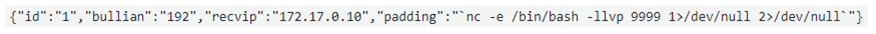

### Vulnerability and Exploitation
### (with Onion Messengers)

 
 

- TA: SeongIl Wi
- DongHyeon Oh

---

## Goals

 

- Logic error : people all make mistakes sometimes |
- Command injection : victim should not be aware |
- Privacy breach : get a sensitive data |

---

## Scenario

- Logic error |
- Control-flow hijack(Command injection) |
- Privacy breach |

※ In a broad sense, command injection is control-flow hijack |

---

## Protocol

---?code=assets/logic1.cpp&lang=c++&title=Recv thread source

@[1-5](Key alive)
@[6-10](Key die)
@[11-22](Get my message)
@[50-54](Not my message. So forwarding)

---

## Logic error

---

## Logic error

---

## Command injection

---

## Command injection

 

 

- {"id":"1", "bullian":"192"...
- "padding":"[COMMAND INJECTION!]"}

---

## Privacy breach

---?code=assets/privacy.cpp&lang=c++&title=pgpgmanaer.cpp

@[7,8,17,18](There is a term)

---

## Demo

---

## Summary

- Logic error

- Control-flow hijack

- Privacy breach

---

# Q & A

---

# Appendix1

- Logic error

A bug in a program that causes it to operate incorrectly,
but not to terminate abnormally (or crash).

-> Send thread is operate incorrectly,
   but not to terminate abnormally!

---

