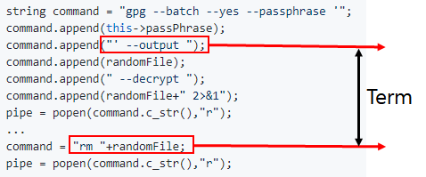
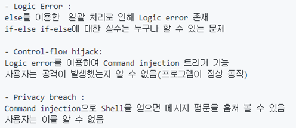

# Vulnerability

- TA: SeongIl Wi
- DongHyeon Oh

---

## Goals

- Logic error : people all make mistakes sometimes
- Command injection : victim should not be aware
- Privacy breach : get a sensitive data

---

## Scenario

- Logic error -> Command injection -> Privacy breach
- In a broad sense, command injection is control flow hijack

---

## Logic error

---

## Logic error

---

## Logic error

---

## Command injection

---

## Command injection

 

---

## Privacy breach

---

## Demo

---

## Summary

---

# Q & A

